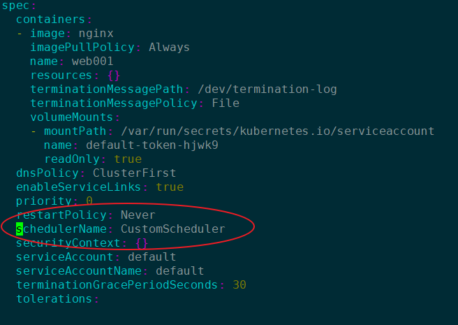

# CustomScheduler


```
k run web001 --image=nginx --restart=Never  -o yaml --dry-run > schedule.yaml 

```
add **CustomScheduler**


```
apiVersion: v1
kind: Pod
metadata:
  creationTimestamp: null
  labels:
    run: web001
  name: web001
spec:
  schedulerName: CustomScheduler  --->  Add this line to define a new schedule
  containers:
  - image: nginx
    name: web001
    resources: {}
  dnsPolicy: ClusterFirst
  restartPolicy: Never
status: {}

```


```
k apply -f scheduler.yaml
```



