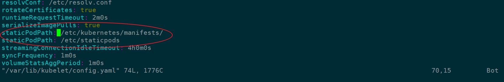

#  statis Pod


```
ps -ef|grep kubelet

```

```
/usr/bin/kubelet \
--bootstrap-kubeconfig=/etc/kubernetes/bootstrap-kubelet.conf \
--kubeconfig=/etc/kubernetes/kubele.conf \
--config=/var/lib/kubelet/config.yaml \
--cgroup-driver=cgroupfs \
--network-plugin=cni \
--pod-infra-container-image=k8s.gcr.io/pause:3.1 \
--resolv-conf=/run/systemd/resolve/resolv.conf

```
其中：**--config=/var/lib/kubelet/config.yaml**

这个配置文件中指明了静态Pod的路径：
**staticPodPath: /etc/kubernetes/manifests**


```
address: 0.0.0.0
apiVersion: kubelet.config.k8s.io/v1beta1
authentication:
  anonymous:
    enabled: false
  webhook:
    cacheTTL: 2m0s
    enabled: true
  x509:
    clientCAFile: /etc/kubernetes/pki/ca.crt
authorization:
  mode: Webhook
  webhook:
    cacheAuthorizedTTL: 5m0s
    cacheUnauthorizedTTL: 30s
cgroupDriver: cgroupfs
cgroupsPerQOS: true
clusterDNS:
- 10.96.0.10
clusterDomain: cluster.local
configMapAndSecretChangeDetectionStrategy: Watch
containerLogMaxFiles: 5
containerLogMaxSize: 10Mi
contentType: application/vnd.kubernetes.protobuf
cpuCFSQuota: true
cpuCFSQuotaPeriod: 100ms
cpuManagerPolicy: none
cpuManagerReconcilePeriod: 10s
enableControllerAttachDetach: true
enableDebuggingHandlers: true
enforceNodeAllocatable:
- pods
eventBurst: 10
eventRecordQPS: 5
evictionHard:
  imagefs.available: 15%
  memory.available: 100Mi
  nodefs.available: 10%
  nodefs.inodesFree: 5%
evictionPressureTransitionPeriod: 5m0s
failSwapOn: true
fileCheckFrequency: 20s
hairpinMode: promiscuous-bridge
healthzBindAddress: 127.0.0.1
healthzPort: 10248
httpCheckFrequency: 20s
imageGCHighThresholdPercent: 85
imageGCLowThresholdPercent: 80
imageMinimumGCAge: 2m0s
iptablesDropBit: 15
iptablesMasqueradeBit: 14
kind: KubeletConfiguration
kubeAPIBurst: 10
kubeAPIQPS: 5
makeIPTablesUtilChains: true
maxOpenFiles: 1000000
maxPods: 110
nodeLeaseDurationSeconds: 40
nodeStatusReportFrequency: 1m0s
nodeStatusUpdateFrequency: 10s
oomScoreAdj: -999
podPidsLimit: -1
port: 10250
registryBurst: 10
registryPullQPS: 5
resolvConf: /etc/resolv.conf
rotateCertificates: true
runtimeRequestTimeout: 2m0s
serializeImagePulls: true
staticPodPath: /etc/kubernetes/manifests    <<<<<<<<<----------------------------------
streamingConnectionIdleTimeout: 4h0m0s
syncFrequency: 1m0s
volumeStatsAggPeriod: 1m0s

```
**staticPodPath: /etc/kubernetes/manifests**


```
ll /etc/kubernetes/manifests

etcd.yaml  
kube-apiserver.yaml  
kube-controller-manager.yaml  
kube-scheduler.yaml


```

##   方法一
把Pod描述文件放到 kubelet config文件制定的目录下


```
/etc/kubernetes/manifests
```

##   方法二
##  配置kubelet参数并重启kubelet


```
 /var/lib/kubelet/config.yaml
```

```
Add this line :

staticPodPath: /etc/staticpods
```

```
sudo systemctl daemon-reload
sudo systemctl restart kubelet
```





