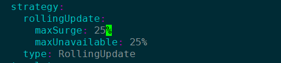

```
apiVersion: apps/v1
kind: Deployment
metadata:
  annotations:
    deployment.kubernetes.io/revision: "2"
    kubectl.kubernetes.io/last-applied-configuration: |
      {"apiVersion":"apps/v1","kind":"Deployment","metadata":{"annotations":{"kubernetes.io/change-cause":"kubectl apply --filename=nginx-svc-and-deployment.yaml --record=true"},"labels":{"app":"nginx"},"name":"nginx-deployment","namespace":"default"},"spec":{"replicas":3,"selector":{"matchLabels":{"app":"nginx"}},"template":{"metadata":{"labels":{"app":"nginx"}},"spec":{"containers":[{"image":"nginx:1.7.9","name":"nginx","ports":[{"containerPort":80}]}]}}}}
    kubernetes.io/change-cause: kubectl set image deploy nginx-deployment nginx=nginx:1.7.11
      --record=true
  creationTimestamp: null
  generation: 1
  labels:
    app: nginx
  name: nginx-deployment
  selfLink: /apis/apps/v1/namespaces/default/deployments/nginx-deployment
spec:
  progressDeadlineSeconds: 600
  replicas: 3
  revisionHistoryLimit: 10
  selector:
    matchLabels:
      app: nginx
  strategy:
    rollingUpdate:
      maxSurge: 25%
      maxUnavailable: 25%
    type: RollingUpdate
  template:
    metadata:
      creationTimestamp: null
      labels:
        app: nginx
    spec:
      containers:
      - image: nginx:1.7.11
        imagePullPolicy: IfNotPresent
        name: nginx
        ports:
        - containerPort: 80
          protocol: TCP
        resources: {}
        terminationMessagePath: /dev/termination-log
        terminationMessagePolicy: File
      dnsPolicy: ClusterFirst
      restartPolicy: Always
      schedulerName: default-scheduler
      securityContext: {}
      terminationGracePeriodSeconds: 30
status: {}

```
