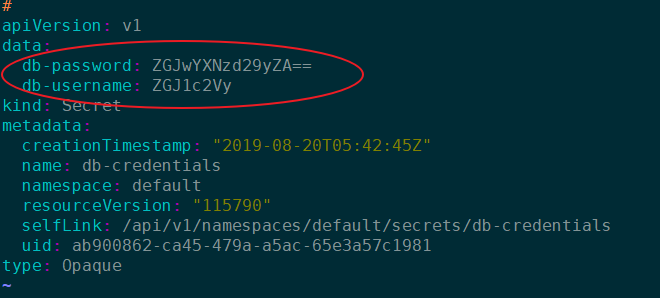
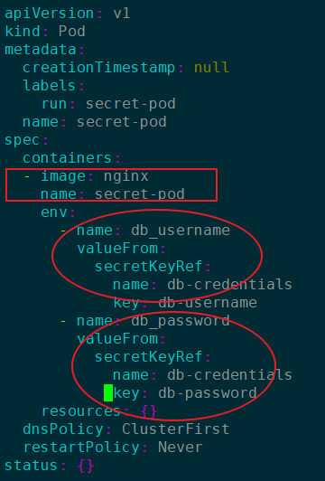

# secret

Create a secret called “db-credentials” directly from the CLI with the following key:value pair.

db-username : dbuser

db-password : dbpassword

Create a pod to leverage these as environment variables.


```
k create secret generic db-credentials --from-literal=db-username=dbuser --from-literal=db-password=dbpassword 
```


```
apiVersion: v1
data:
  db-password: ZGJwYXNzd29yZA==
  db-username: ZGJ1c2Vy
kind: Secret
metadata:
  creationTimestamp: "2019-08-20T05:42:45Z"
  name: db-credentials
  namespace: default
  resourceVersion: "115790"
  selfLink: /api/v1/namespaces/default/secrets/db-credentials
  uid: ab900862-ca45-479a-a5ac-65e3a57c1981
type: Opaque

```





```
echo "ZGJwYXNzd29yZA==" |base64 --decode

dbpassword
```


```
echo "ZGJ1c2Vy" |base64 --decode


dbuser
```


**CHECK**


```
k run secret-pod --image=nginx --restart=Never  -o yaml --dry-run  > secret-pod.yaml
```


```
apiVersion: v1
kind: Pod
metadata:
  creationTimestamp: null
  labels:
    run: secret-pod
  name: secret-pod
spec:
  containers:
  - image: nginx
    name: secret-pod
    env:
      - name: db_username
        valueFrom:
          secretKeyRef:
            name: db-credentials
            key: db-username
      - name: db_password
        valueFrom:
          secretKeyRef:
            name: db-credentials
            key: db-password
    resources: {}
  dnsPolicy: ClusterFirst
  restartPolicy: Never
status: {}

```




