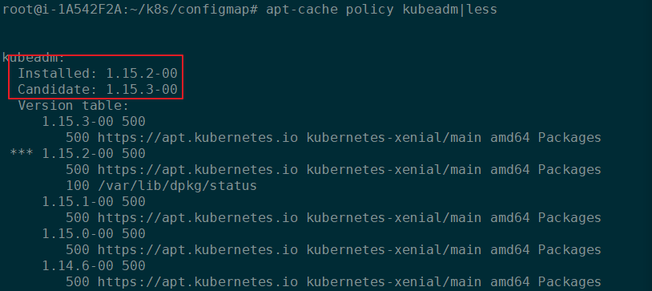

# Upgrading kubeadm clusters

## Determine which version to upgrade to


```
apt update
apt-cache policy kubeadm
```

```
apt-cache policy kubeadm|less
```





## Upgrading control plane nodes


```
# replace x in 1.15.x-00 with the latest patch version
apt-mark unhold kubeadm && \
apt-get update && apt-get install -y kubeadm=1.15.x-00 && \
apt-mark hold kubeadm
```

```shell
kubeadm version
```

```shell
sudo kubeadm upgrade plan
```
```shell
sudo kubeadm upgrade apply v1.15.x
```


```shell
sudo Manually upgrade your CNI provider plugin.

```
```
# replace x in 1.15.x-00 with the latest patch version
apt-mark unhold kubelet kubectl && \
apt-get update && apt-get install -y kubelet=1.15.x-00 kubectl=1.15.x-00 && \
apt-mark hold kubelet kubectl
```

## Upgrade worker nodes
```
# replace x in 1.15.x-00 with the latest patch version
apt-mark unhold kubeadm && \
apt-get update && apt-get install -y kubeadm=1.15.x-00 && \
apt-mark hold kubeadm
```

```shell
kubectl drain $NODE --ignore-daemonsets
```
```shell
sudo kubeadm upgrade node
```

```
# replace x in 1.15.x-00 with the latest patch version
apt-mark unhold kubelet kubectl && \
apt-get update && apt-get install -y kubelet=1.15.x-00 kubectl=1.15.x-00 && \
apt-mark hold kubelet kubectl
```

```shell
sudo systemctl restart kubelet
```
```shell
kubectl uncordon $NODE
```

```shell
kubectl get nodes
```


