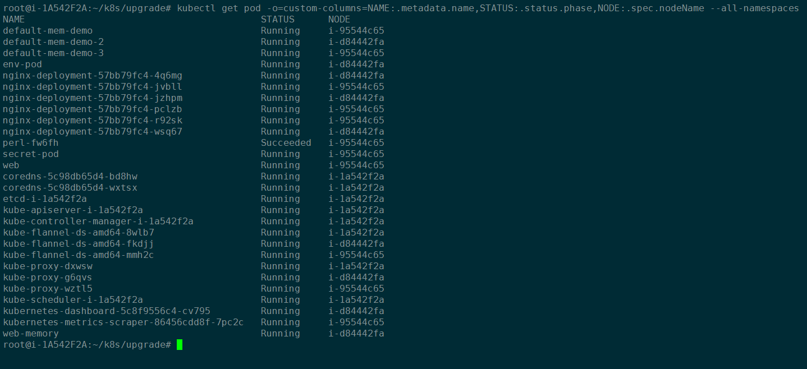
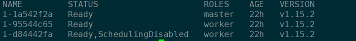
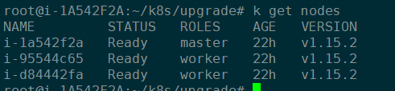

#  [custom columns](https://kubernetes.io/docs/reference/kubectl/overview/#custom-columns):


```
kubectl get pod -o=custom-columns=NAME:.metadata.name,STATUS:.status.phase,NODE:.spec.nodeName --all-namespaces
```


```
kubectl get pod -o=custom-columns=NODE:.spec.nodeName,NAME:.metadata.name --all-namespaces
```





#  drain a node


```
kubectl drain k8s-worker-03 --ignore-daemonsets
```




#  Gracefully return a node into active service


```
k uncordon i-d84442fa
```



