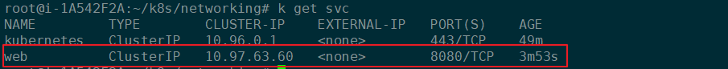
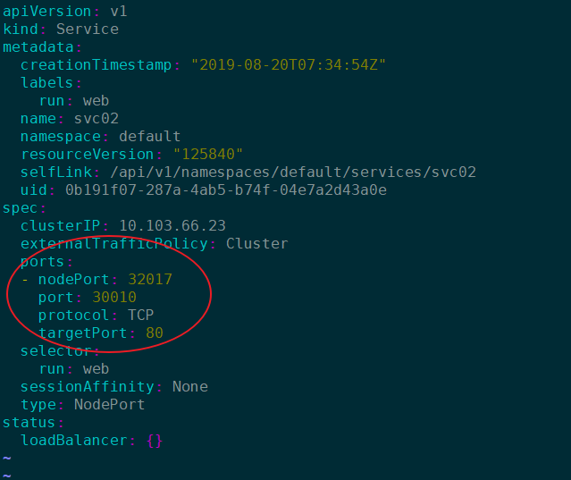

# ClusterIP:

```
k  run web --image=nginx --replicas=3
```


```
k expose deployment web --port=8080 --target-port=80  --type=ClusterIP

```





```
k run busybox --image=busybox --restart=Never -ir --rm -- sh
```

```
wget -O- svc:Port
```
#  NodePort


```
k  run web --image=nginx --replicas=3
```


```
k expose deployment web --port=30010 --target-port=80  --type=NodePort

```





```
k run busybox --image=busybox --restart=Never -ir --rm -- sh
```

```
wget -O- svc:Port
```


```
wget  -O- NodeIP:NodePort  
```

